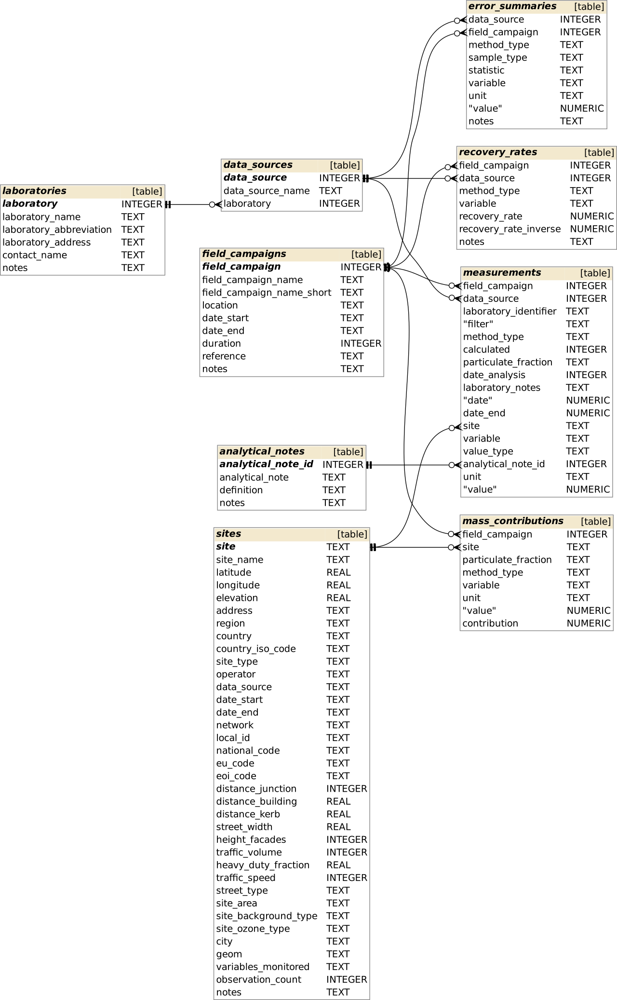

# **pmcharacterr**

[](https://travis-ci.org/skgrange/pmcharacterr)

## Introduction

**pmcharacterr** is an R package which interfaces with a database with a specific data model which stores detailed atmospheric particulate matter (PM) observations. The data model has been implemented with a [SQLite](https://www.sqlite.org/index.html) database for a specific research project which involved three filter-based sampling campaigns. It allows for rapid, efficient, and easy access to PM observations and their metadata. Care has been taken to handle the various pieces of data which are required for the application of source apportionment models. 

## Installation

To install the development version, install [**remotes**](https://github.com/r-lib/remotes) first, then try this: 

```
# Install pmfr
remotes::install_github("skgrange/pmcharacterr")
```

## The data model

An entity-relationship diagram of the core data model looks like this:



## Usage

**pmcharacterr** contains many `import_*` functions which are used to import various data-units as data frames/tibbles. 
